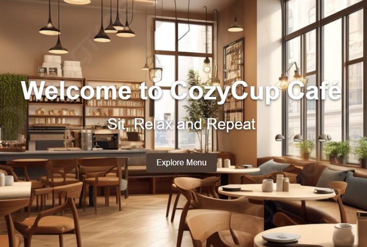
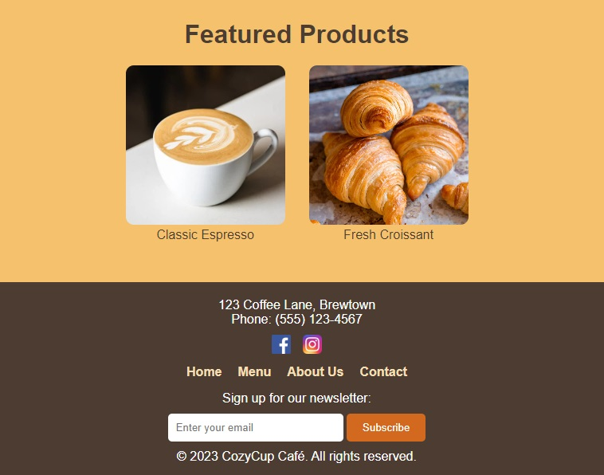
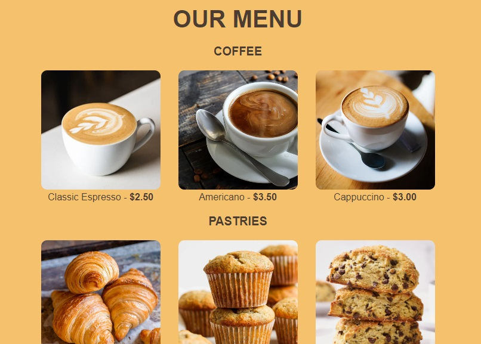
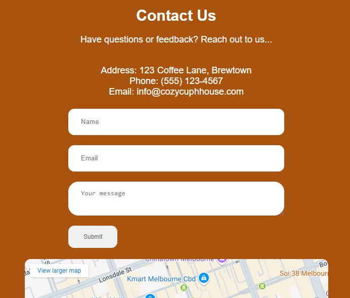

<h1>Project Description:</h1>

A simple website for a cozy cafe, featuring popular products such as pastries and coffee blends

<h1>Features:</h1>
<ul>
  <li>Classic Expresso</li>
  <li>Fresh Croissant</li>
</ul>
<h1>Screen Captures:</h1>

    
    
This is the hero section, as well the Home page.

    
    
At the bottom of the Home page, there is the Feature products

    
    
This is the menu page

    
    
This is the contact page

<h1>About the Authors</h1>

<b>Name: </b>Arjay S. Timbancaya

<b>Email: </b>timbancayaarjay@gmail.com

  
  

